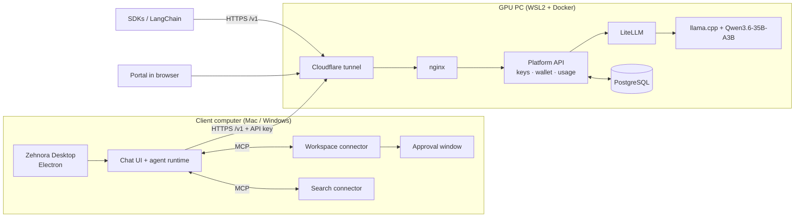

<h1 align="center">Zehnora</h1>

<p align="center">
  <strong>Your coding assistant on your own GPU.</strong><br/>
  A self-hosted AI platform: an OpenAI-compatible model API with accounts, keys and credits,<br/>
  plus a desktop coding agent that works on real files in a folder you choose.
</p>

<p align="center">
  <a href="#quick-start-mac">Quick start</a> ·
  <a href="#architecture">Architecture</a> ·
  <a href="#repository-layout">Layout</a> ·
  <a href="zehnora/docs/Zehnora-Setup-Guide.pdf">Setup guide (PDF)</a> ·
  <a href="zehnora/docs/STATUS.md">Status</a>
</p>

---

## What is Zehnora?

Zehnora has two products that share one repository.

### Zehnora API
It runs on one GPU machine that you own and serves an open-weight model through an OpenAI-compatible API.

- **Accounts and API keys.** Users sign up in a web portal and create keys there. Keys are stored only as HMAC fingerprints, never the secret itself.
- **Credit wallet.** An administrator grants credits. Each request reserves credits before it runs and is charged for its actual usage when it finishes. Every change is written to an append-only ledger.
- **`/v1` API** (`/v1/models`, `/v1/chat/completions`, with streaming). It works with the OpenAI SDK, LangChain and other compatible tools.
- **Portal.** A customer dashboard with usage, keys and a playground, plus an admin console.
- **Locked-down ingress.** Only the API is exposed to the internet, through nginx and a Cloudflare tunnel. LiteLLM and the model server have no public route.

### Zehnora Desktop
A desktop app for Mac and Windows that uses the Zehnora API as its model.

- **Coding agent with a real workspace.** It creates and edits files, runs builds and tests, starts dev servers and inspects pages, all inside one folder you choose.
- **Approval window.** Any command outside the allowlist waits for your click before it runs.
- **Web search.** Search runs on a private SearXNG instance, with safe page fetching.
- **Google Workspace connector (optional).** It turns on when you supply your own OAuth client.

## Architecture



A model request follows this path: API key → account → model scope → **atomic credit reservation** → LiteLLM → model server → streamed response → **settlement on actual usage**. The API never runs tools. Tools run only on the user's own machine, through the desktop connectors.

The full design is in [`zehnora/docs/ARCHITECTURE.md`](zehnora/docs/ARCHITECTURE.md).

## Tech stack

| Layer | Technology |
|---|---|
| Platform API | Python 3.12, FastAPI, SQLAlchemy, Alembic, PostgreSQL 17 |
| Model | Qwen3.6-35B-A3B (MoE coding model, 3B active) on llama.cpp with GPU + RAM offload · vLLM as an alternative engine |
| Model gateway | LiteLLM · a small CPU model and a labelled mock model for development |
| Portal | React, TypeScript, Vite |
| Desktop | Electron, a LibreChat-based chat UI and agent runtime, MongoDB |
| Connectors | MCP servers in Python (workspace, search) and the Google Workspace MCP |
| Deployment | Docker Compose, nginx, Cloudflare named tunnel |

## Quick start (Mac)

Development runs as native processes, and everything listens only on `127.0.0.1`. The full first-time setup (Node, PostgreSQL, MongoDB, uv) is in the [setup guide](zehnora/docs/Zehnora-Setup-Guide.pdf) and in [`MAC-DEVELOPMENT.md`](zehnora/docs/MAC-DEVELOPMENT.md).

```bash
git clone https://github.com/Inshal-Amir/Zehnora.git zehnora
cd zehnora

# Platform: PostgreSQL, model, LiteLLM, platform API, portal
zehnora/scripts/mac/dev-platform.sh start mock           # labelled mock model, fastest
zehnora/scripts/mac/dev-platform.sh start dev-local-4b   # or a small real model on the CPU

# Desktop app
zehnora/scripts/mac/start-desktop.sh

# Status / stop
zehnora/scripts/mac/dev-platform.sh status
zehnora/scripts/mac/dev-platform.sh stop
```

| Service | Address |
|---|---|
| Portal | http://127.0.0.1:5173 |
| Platform API | http://127.0.0.1:8200/v1 |
| Desktop chat UI | http://127.0.0.1:3090 |

### Use the API from code

```python
from openai import OpenAI

client = OpenAI(base_url="http://127.0.0.1:8200/v1", api_key="<key from the portal>")
reply = client.chat.completions.create(
    model="zehnora-coder",
    messages=[{"role": "user", "content": "Write a Python function that reverses a string."}],
)
print(reply.choices[0].message.content)
```

## Deploying on the GPU PC

The server profile (llama.cpp with Qwen3.6-35B-A3B, LiteLLM, PostgreSQL, platform API, portal, nginx and tunnel) is deployed with Docker Compose on Windows + WSL2. Follow [`GPU-PC-DEPLOYMENT.md`](zehnora/docs/GPU-PC-DEPLOYMENT.md) step by step. The model weights are downloaded only on the GPU PC and never committed.

## Repository layout

All Zehnora code lives in [`zehnora/`](zehnora/). The chat UI and agent runtime at the repository root come from LibreChat.

| Path | What it holds |
|---|---|
| `zehnora/platform-api/` | FastAPI platform: accounts, keys, credit wallet, `/v1` API, admin |
| `zehnora/portal/` | Customer and admin console |
| `zehnora/desktop/` | Electron shell, status bar, approval window |
| `zehnora/connectors/` | MCP connectors: `workspace/`, `search/`, `google/` |
| `zehnora/infra/` | LiteLLM profiles, mock model, client config, server Compose, nginx, tunnel |
| `zehnora/scripts/` | Start, stop, health and deploy scripts for `mac/`, `server/` and `windows/` |
| `zehnora/tests/` | End-to-end tests and screenshots as evidence |
| `zehnora/brand/` | Product name, colours and strings |
| `zehnora/docs/` | Status, architecture, API contract, deployment and limitations |

## Documentation

- [Status and next steps](zehnora/docs/STATUS.md)
- [Architecture](zehnora/docs/ARCHITECTURE.md)
- [API contract](zehnora/docs/API-CONTRACT.md)
- [Credits and recovery](zehnora/docs/CREDITS-AND-RECOVERY.md)
- [Mac development](zehnora/docs/MAC-DEVELOPMENT.md)
- [GPU PC deployment](zehnora/docs/GPU-PC-DEPLOYMENT.md)
- [Google setup](zehnora/docs/GOOGLE-SETUP.md)
- [Known limitations](zehnora/docs/KNOWN-LIMITATIONS.md)

## Project status

This is a working demo. On the Mac, the platform, portal, desktop app and connectors run end to end with the mock model and with a small CPU model. The GPU deployment, Windows support and the Google connector are written but not yet tested on real hardware. The honest list is in [`KNOWN-LIMITATIONS.md`](zehnora/docs/KNOWN-LIMITATIONS.md).

## License and credits

Zehnora Desktop's chat UI and agent runtime are built on [LibreChat](https://github.com/danny-avila/LibreChat) (MIT). The original license is kept in [`LICENSE`](LICENSE), and third-party notices are in [`THIRD-PARTY-NOTICES.md`](THIRD-PARTY-NOTICES.md).
