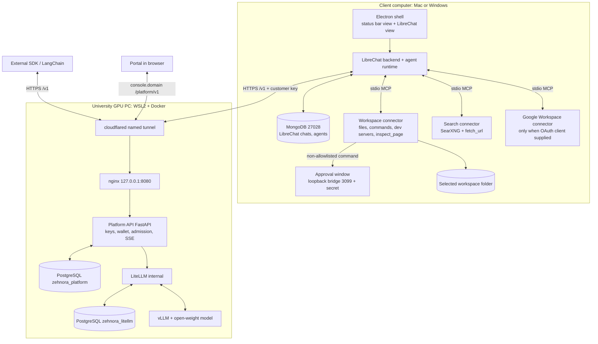

# Zehnora architecture

Two connected products in one repository (LibreChat v0.8.7 at the root, Zehnora code under `zehnora/`):

1. **Zehnora API**: signup, admin-granted credits, customer API keys, usage reporting and an OpenAI-compatible model API running on the university GPU PC.
2. **Zehnora Desktop**: LibreChat's own UI, backend and agent runtime in an Electron shell, with local connectors (workspace files/commands, web search, Google Workspace) on the user's machine.

## Where each thing runs

| Component | Mac development (now) | Final location |
|---|---|---|
| LibreChat + MongoDB + Electron + connectors | Mac, native processes (`scripts/mac/start-desktop.sh`) | Each client computer |
| Platform API + portal + PostgreSQL + LiteLLM | Mac, native processes (`scripts/mac/dev-platform.sh`) | GPU PC, Docker Compose (`infra/server/compose.yaml`) |
| Model | `mock` (labelled) or `dev-local-4b` (Qwen3.5-4B Q4 on the Mac CPU; development stand-in) | GPU PC: vLLM + official BF16 weights |
| Public ingress | none (loopback only) | nginx + named Cloudflare Tunnel on the GPU PC |

## Request paths
- **Model request:** SDK/LibreChat → `https://api.<domain>/v1` → nginx (only `/v1/models`, `/v1/chat/completions`) → platform API (key → account → model scope → **atomic reservation**) → LiteLLM (with the same customer key) → vLLM → streamed/JSON response → **settlement on actual usage**. There is no route from the internet to LiteLLM or vLLM.
- **Agent action:** LibreChat sends messages + tool schemas to the model → model returns `tool_calls` → LibreChat calls the local MCP connector → result goes back → next model round, until done or bounded failure (recursion limit 25 ≈ 12 rounds; retries of an identical failing call are capped at 2 by the connectors). The public API never executes tools.
- **Portal playground:** portal session → platform API → same admission/credit pipeline, charged to the logged-in account, using a restricted server-held gateway key that never reaches the browser.

## Data placement
| Data | Store |
|---|---|
| Platform accounts, sessions, wallets, append-only ledger, API-key metadata (HMAC fingerprint, never the secret), usage, playground chats, audit | PostgreSQL `zehnora_platform` (GPU PC) |
| LiteLLM virtual keys and its own spend logs | PostgreSQL `zehnora_litellm` (separate role/database; accessed only through LiteLLM's API) |
| LibreChat accounts, conversations, agents | MongoDB on the client |
| Generated projects | The selected workspace folder on the client |
| Google OAuth tokens | Connector credentials folder in the client's protected secrets directory |
| Zehnora API key used by Desktop | OS-encrypted file (Electron `safeStorage`), passed only to the LibreChat service process |
| Model weights | GPU PC SSD, outside Git |

The platform account and the local LibreChat account are **separate** in this release: create a platform account and key in the portal, then connect that key in Desktop. There is no shared login or cross-device chat sync.

## Security boundaries (implemented)
- The Electron chat view has no preload and no Node; the status bar and approval windows use narrow sandboxed preloads; navigation is locked to the local LibreChat origin.
- Workspace connector: real-path confinement (symlinks/junctions resolved), hidden and file-like folder names refused, backups before overwrite, size and output caps, scrubbed child environment, autonomous build/test allowlist, everything else requires the approval window. **Not a sandbox.**
- Search connector: public http(s) only, private/loopback/link-local/metadata addresses blocked at every redirect hop, page text labelled untrusted.
- Platform: Argon2id passwords, HttpOnly session cookie + session-bound CSRF token, login throttling, exact CORS origins, admin only via the local bootstrap CLI, fail-closed billing.
